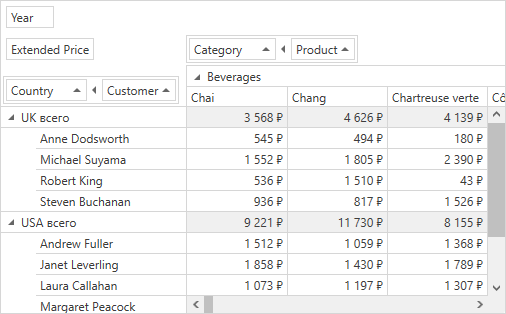

<!-- default file list -->
*Files to look at*:

* [MainWindow.xaml](./CS/HowToGroupFields/MainWindow.xaml) (VB: [MainWindow.xaml](./VB/HowToGroupFields/MainWindow.xaml))
* [MainWindow.xaml.cs](./CS/HowToGroupFields/MainWindow.xaml.cs) (VB: [MainWindow.xaml.vb](./VB/HowToGroupFields/MainWindow.xaml.vb))
<!-- default file list end -->
# How to: Group Fields

The following example demonstrates how to combine [fields](https://docs.devexpress.com/WPF/8024) into a [group](https://docs.devexpress.com/WPF/8020).

In this example, two fields ("Country" and "Customer") are combined into a new group at design time, and another two fields ("Category" and "Product") are combined into a new group at runtime, in this order. This ensures that the "Country" field is followed by "Customer", and the the "Category" field is followed by "Product". If you drag the "Region" field and drop it to another area, the "Customer" field accompanies it. This behavior is also true for the second group.

